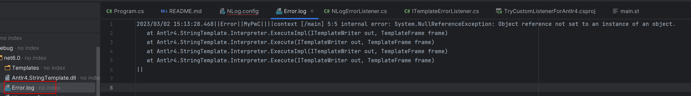

template
```
main(content) ::= <<
<!DOCTYPE HTML PUBLIC "-//W3C//DTD HTML 4.01//EN" "http://www.w3.org/TR/html4/strict.dtd">
<html>
	<head></head>
<body>
    $strlen(content)$
</body>
</html>
>>
```

set content to `Null`, then render with default error listener
```csharp
mainTemplate.Add("content", null);
mainTemplate.Write(new AutoIndentWriter(writer));
```

result an internal error, it writes to console
```
context [/main] 5:5 internal error: System.NullReferenceException: Object reference not set to an instance of an object.
   at Antlr4.StringTemplate.Interpreter.ExecuteImpl(ITemplateWriter out, TemplateFrame frame)
   at Antlr4.StringTemplate.Interpreter.Execute(ITemplateWriter out, TemplateFrame frame)
   at Antlr4.StringTemplate.Interpreter.ExecuteImpl(ITemplateWriter out, TemplateFrame frame)
   at Antlr4.StringTemplate.Interpreter.Execute(ITemplateWriter out, TemplateFrame frame)

<!DOCTYPE HTML PUBLIC "-//W3C//DTD HTML 4.01//EN" "http://www.w3.org/TR/html4/strict.dtd">
<html>
        <head></head>
<body>
```

use custom error listener
```csharp
mainTemplate.Write(new AutoIndentWriter(writer), new NLogErrorListener());
```

results internal error, write to file
